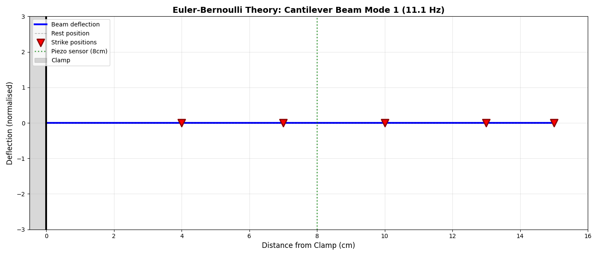

# Piezoelectric Vibration Classifier

Building a complete ML pipeline from scratch: collecting real vibration data with Arduino, training a classifier, and checking how far simple beam theory explains what I measured.

***

  
*What theory suggests versus what I actually measured. The classifier reached 67% accuracy, but the physical system was messier than the ideal model.*

***

## Summary

* **Goal:** classify strike position using real piezoelectric vibration data  
* **Pipeline:** Arduino plus piezo disc, 50 samples, 13 features, Random Forest  
* **Result:** 67% test accuracy (10 out of 15 correct) across 5 positions, 20% baseline  
* **Main finding:** energy and amplitude features dominated, frequency features were less stable than expected  
* **Time spent:** less than 2 weeks (hardware setup, data collection, analysis)

Built independently to understand the hardware to algorithm workflow end to end.

***

## Motivation

I wanted to work through the full process of using real sensor data, from wiring a sensor to training a model. This project records vibration signals from a clamped ruler using a piezo sensor, extracts features, trains a Random Forest classifier, then compares parts of the result to a simple cantilever beam estimate.

The core question was simple: can I classify where I hit a ruler based on how it vibrates?

I had done ML on clean datasets (internship work and coursework), but not with hardware. I wanted to see what changes when you deal with:

* Sensors that saturate and add noise
* Physical systems with awkward boundary conditions and trial to trial variability
* Messy signals where feature choice matters as much as model choice

I was also curious whether classical mechanics could help predict which features would be informative.

***

## Results at a glance

* Test accuracy: **67%** (10 out of 15 correct)
* Baseline: 20% (random guessing across 5 classes)
* Dataset size: 50 samples (5 classes, 10 samples each)
* Most important feature: total energy (13.3% importance)
* Theory comparison: poor amplitude fit (R² = minus 25), informative failure
* Dominant frequency: 22.5 Hz measured versus about 11 Hz estimated from a basic model

Main takeaway: the model relied most on energy and amplitude because those were the most consistent signals across trials.

***

## Hardware Setup

### What I used

* 27 mm piezoelectric disc (about £4 from Amazon)
* Arduino Uno
* Breadboard
* Jumper wires
* Copper conductive tape
* 30 cm plastic ruler
* Microphone clamp
* Electrical tape (strain relief)

  
*Experimental setup: piezo sensor mounted 8 cm from the clamp. Tape was used for strain relief.*

### How it works

The piezo generates a voltage when the ruler bends. The Arduino samples the signal at 100 Hz using its 10 bit ADC (integer values from 0 to 1023) and sends the readings to Python over serial.

Signal chain: PC (Python) to Arduino to breadboard to jumper wires to the piezo leads (wires soldered to the disc), with copper conductive tape used to secure the connection and reduce intermittent contact.

One important limitation is the ADC range. With the default analogue reference, the Uno maps 0 V to 5 V into 0 to 1023, and it cannot represent negative voltage. Piezo signals are effectively bipolar, so without a bias circuit the negative swing is lost, and large positive swings can clip at the 5 V limit.

I first tried mounting the sensor close to the free end, but the connection failed repeatedly under motion. Mounting at 8 cm gave a strong signal with less mechanical stress at the joint.

***

## Data Collection

### The process

I struck the ruler at 5 positions (4 cm, 7 cm, 10 cm, 13 cm, 15 cm from the clamp), recorded 1 second of vibration data each time, and repeated this 10 times per position (50 samples total). Strike strength was hard to standardise, which is why I collected 10 repeats per position to reduce trial to trial variation.

### Problems encountered

1. **Sensor connection kept failing early on**, fixed by improving the joint and adding strain relief (copper tape plus electrical tape).
2. **Positions at 13 cm and 15 cm often clipped at 1023**, which is the ADC maximum. This likely reduced separability between those classes, since clipped waveforms can look artificially similar.
3. **The ruler broke during the first attempt**, I replaced it and repeated the same setup.

***

## Feature Engineering

I computed 13 features from each 1 second vibration signal.

**Time domain (7 features):**

* Mean
* Standard deviation
* Max
* Min
* Peak to peak
* RMS
* Total energy (sum of squared values)

**Frequency domain (6 features):**

* FFT based dominant frequency
* Spectral power
* Spectral centroid
* Mean FFT magnitude
* Standard deviation of FFT magnitude
* Additional summary magnitude statistics

I included both sets because I was not sure whether amplitude and energy differences or frequency content would be more useful. In practice, amplitude and energy were more consistent across trials.

***

## Classification Results

### Model choice

Random Forest, chosen because it handles non linear relationships well and exposes feature importance. Train test split was 70% training, 30% testing.

**Test accuracy:** 67% (10 out of 15 correct)  
**Baseline:** 20%

  
*Confusion matrix. Position 0 is cleanly separated, the middle positions are harder.*

### What worked

* Position 0 (closest to the clamp) was consistently low energy and easy to identify.
* Energy features were the most important group (total energy at 13.3% importance).
* The model learned a broad trend: strikes further from the clamp tend to produce higher energy signals.

  
*Feature importance. Energy and amplitude features dominate.*

### What did not work well

* The middle positions were frequently confused, which makes sense because they are less distinct than the extremes.
* ADC clipping made positions 3 and 4 look artificially similar, because large parts of the waveform hit 1023.
* Frequency related features were less discriminative than I expected, likely because each strike excites multiple modes and the relative contribution varies across trials.

  
*Example signals. Positions 3 and 4 show clipping and distorted shapes due to saturation.*

***

## Physics Validation

I compared my measurements to a basic cantilever beam estimate to see whether the signal characteristics lined up with theory, or whether the classifier might be picking up artefacts of the setup.

### What the theory gives you

A common estimate for the fundamental frequency of a cantilever beam is:

$$
f_1 = \frac{\lambda_1^2}{2\pi L^2}\sqrt{\frac{EI}{\rho A}}
$$

Using rough parameters for a plastic ruler (E about 2.5 GPa, length 15 cm, thickness 1 mm), this gives **f₁ about 11 Hz**.

### What I measured

* Average dominant frequency: **22.5 Hz**
* Amplitude pattern versus the simplest model: **R² = minus 25** (worse than predicting the mean)

  
*Illustration of the simple model behaviour. Reality is not this clean.*

  
*Amplitude distribution: theory versus experiment. The fit is poor, but there is still a broad trend.*

### Why the mismatch is plausible

A few things push the experiment away from the ideal model:

* A strike is an impulse, it excites multiple modes, not just the fundamental.
* The clamp is not perfectly rigid, so the boundary condition is not ideal.
* The sensor measures local strain at 8 cm, not tip displacement, so the mapping to the textbook deflection profile is not direct.
* Clipping at 13 cm and 15 cm distorts amplitude based comparisons.
* The ADC does not represent negative swing without biasing, which changes the measured waveform shape.

I was hoping the match would be tighter, but the gap is informative. It shows the difference between a clean analytical model and a real measurement chain, while still leaving enough structure for an ML model to classify the positions.

  
*Sensor traces across all 5 positions.*

***

## Discussion

### Why energy beat frequency

My initial intuition was that frequency content might help separate positions, because striking at different points changes which modes are strongly excited. In practice, frequency content was not stable enough across trials, while energy and amplitude changed more consistently with strike location. With this setup, energy was simply a more reliable signal.

### Hardware constraints mattered

ADC clipping at 13 cm and 15 cm is a clear example of how measurement limits can dominate downstream performance. Even a better model cannot recover information that was clipped at the sensor stage. If I repeated this, fixing dynamic range would be the first priority.

### The theory comparison was still useful

Even though the simple model did not fit well numerically (negative R²), it helped interpret what I was seeing:

* It gave a reference scale for expected frequencies.
* It highlighted which assumptions were being violated.
* It supported the qualitative idea that energy tends to increase towards the free end, which helped motivate feature choice.

***

## Limitations and future work

Things I would improve first:

* Add voltage scaling (for example a resistor divider) to prevent clipping at 1023
* Add a mid rail bias so the piezo signal sits within the ADC range and negative swing is represented
* Use a more rigid clamp, or at least characterise clamp compliance
* Collect more samples (50 is small, 200 would give a better estimate of generalisation)
* Repeat after remounting the sensor to test repeatability properly
* Try different ruler materials (metal, wood) to see whether the same features remain useful

Possible extensions:

* Real time classification (currently offline)
* Include damping as a variable (for example finger contact versus free vibration)
* Compare classifiers (SVM, neural network) on the same feature set
* Better resonance characterisation (for example Q factor estimation)
* Multi sensor setup to capture more of the mode shape

***

## Repository organisation

High level structure:

```text
README.md
requirements.txt
arduino/
  piezo_reader.ino
src/
  collect_data.py
  extract_features.py
  train_classifier.py
  visualise_results.py
  validate_physics.py
data/
  raw/
  features/
models/
results/
```

***

## Installation and usage

### Setup

1. Clone the repository.
2. Create a Python environment.
3. Install the dependencies listed in `requirements.txt`.

### Reproduce results

Run these in order:

```bash
python src/extract_features.py
python src/train_classifier.py
python src/visualise_results.py
python src/validate_physics.py
```

### Collect your own data

1. Upload `arduino/piezo_reader.ino` to an Arduino Uno.
2. Connect the piezo disc to A0 (signal) and GND.
3. Mount the sensor at 8 cm from the clamp.
4. Run `python src/collect_data.py` and follow the prompts.

***

## Dependencies

This uses the standard scientific Python stack (see `requirements.txt` for exact versions):

* numpy
* scipy
* scikit learn
* matplotlib
* pyserial
* pillow

***

## License

MIT.
