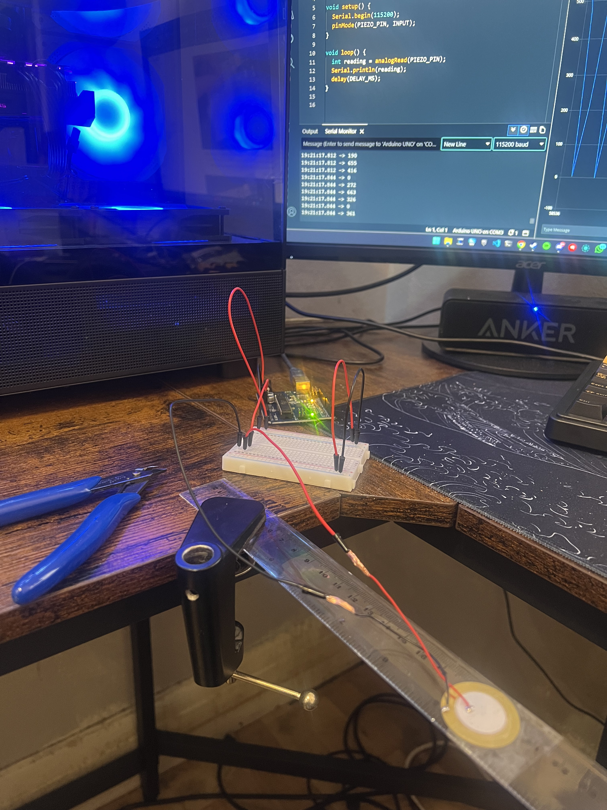
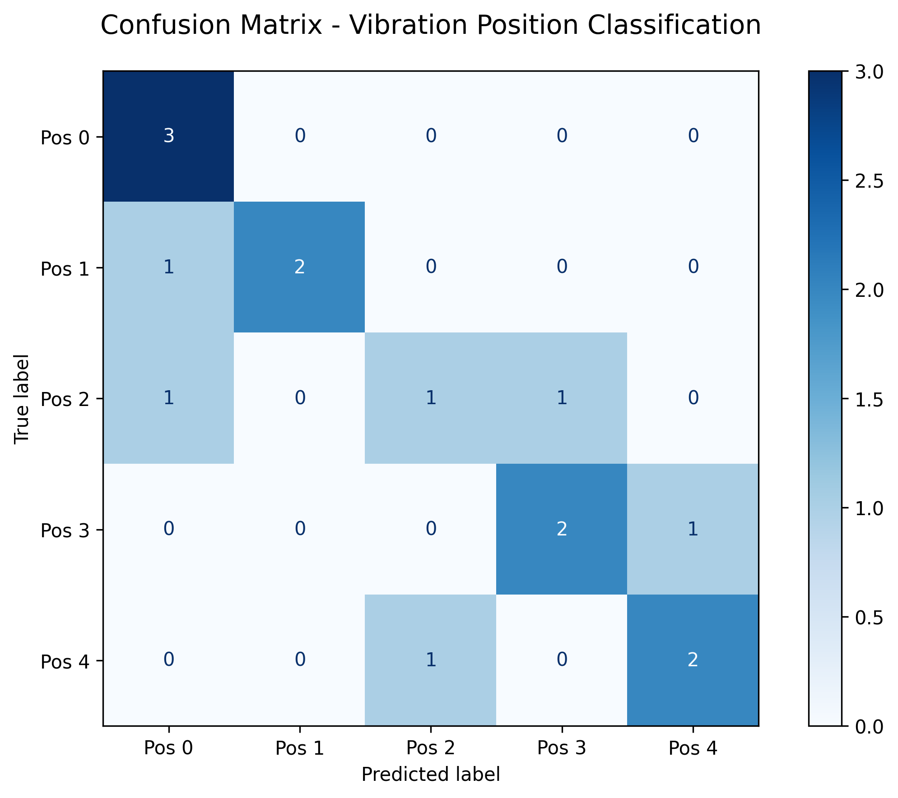
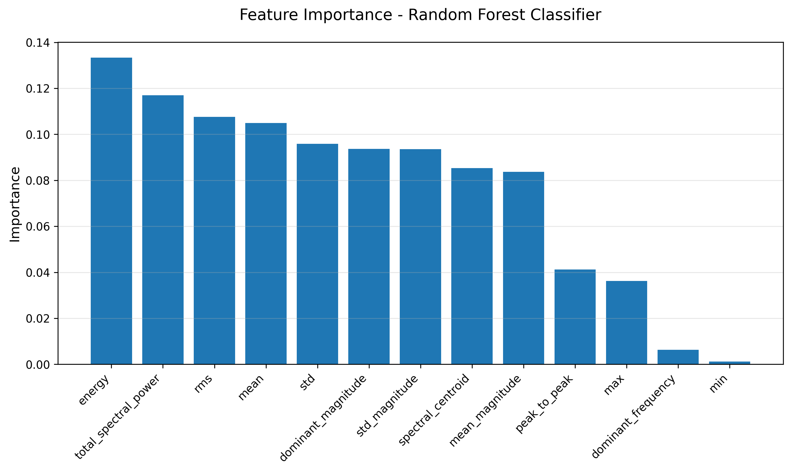
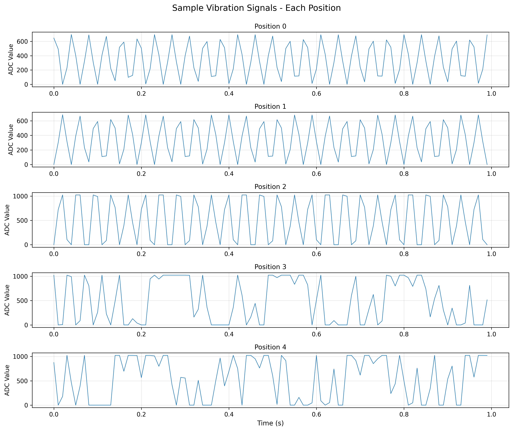
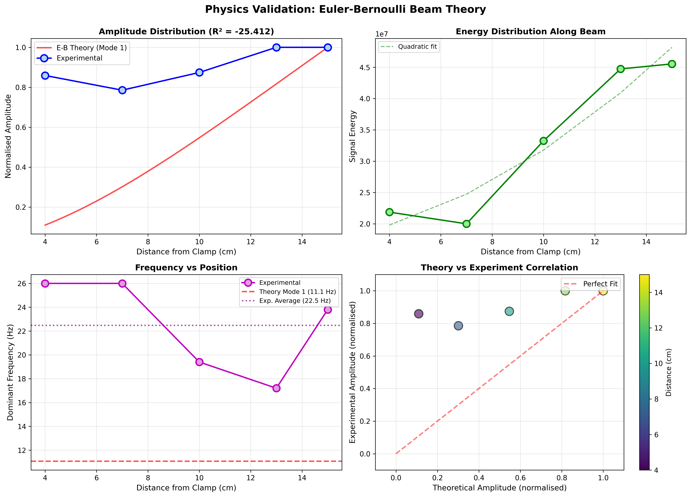
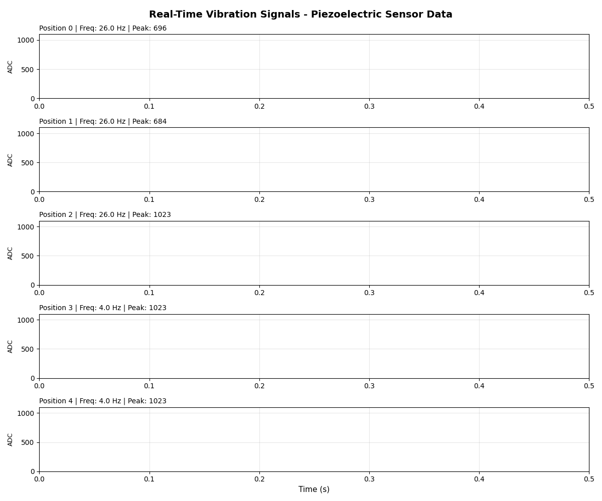

# Piezoelectric Vibration Classifier

Building a complete ML pipeline from scratch: collecting real sensor data with Arduino, training a classifier, and comparing results to physics theory.

**Josh Das** | BSc MORSE, University of Southampton | February 2026

---

## Summary

**What:** ML classifier for vibration positions using real piezoelectric sensor data  
**Method:** Arduino + piezo disk to 50 samples to 13 features to Random Forest  
**Result:** 67% accuracy (vs 20% baseline) across 5 positions  
**Finding:** Energy features dominated; physics theory only partially matched experiment  
**Time:** About 2 weeks (hardware design, data collection, analysis)

Built independently to understand hardware-to-algorithm workflow end-to-end.

---

## Motivation

I wanted to understand the full process of working with real sensor data, from soldering wires to training models. This project collects vibration data from a ruler with a piezo sensor, extracts features, trains a Random Forest classifier, and checks whether the experimental results match what beam theory predicts.

It's basically: "Can I classify where I hit a ruler based on how it vibrates?" Turns out the answer is yes (67% accuracy), but the physics gets more complicated than expected.

I'd done plenty of ML on clean datasets (IBM internship, coursework), but never dealt with actual hardware. I wanted to see what changes when you're working with:
- Real sensors that saturate and add noise
- Physical systems that don't behave like textbook examples  
- Messy data where you have to decide what features actually matter

Plus I was curious whether classical mechanics could predict what features would work best for classification.

---

## Results at a Glance

| Metric | Value |
|--------|-------|
| Test Accuracy | **67%** (10/15 correct) |
| Baseline | 20% (random guessing) |
| Dataset Size | 50 samples (5 classes, 10 samples each) |
| Most Important Feature | Total Energy (13.3% importance) |
| Theory Match | Poor (R² = -25) but informative |
| Dominant Frequency | 22.5 Hz (vs 11 Hz predicted) |

**Key Finding:** Energy features outperformed frequency features despite theory suggesting the opposite. The classifier learned what was actually reliable in messy real-world data.

---

## Hardware Setup

### What I Used
- 27mm piezoelectric disk (£3 from eBay)
- Arduino Uno (had it lying around)
- 30cm plastic ruler
- Desk clamp
- Electrical tape (for strain relief, learned this the hard way)


*Actual experimental setup: piezo sensor mounted at 8cm from clamp, with electrical tape for strain relief*

### How It Works

```
     Clamp        Sensor              Free End
       |==============o===================|
      0cm           8cm                 30cm
```

The piezo generates voltage when the ruler bends. Arduino reads it (10-bit ADC, so 0-1023 values) at 100 Hz and sends to Python over serial. When you hit the ruler, it vibrates and the sensor picks up the oscillation.

I tried placing the sensor at the free end first but the wire kept disconnecting. Mounting at 8cm was the sweet spot: strong enough signal without too much mechanical stress.

---

## Data Collection

### The Process
Hit the ruler at 5 different positions (4cm, 7cm, 10cm, 13cm, 15cm from clamp), record 1 second of vibration data each time, repeat 10 times per position. Total: 50 samples.

Hitting consistently was harder than expected. I used the same pen each time and tried to keep the force similar, but there's definitely variability in the data.

### Problems Encountered
1. **Sensor kept disconnecting** at first, fixed by twisting the wires and adding tape as strain relief
2. **Positions 3 and 4 maxed out the ADC** (both hit 1023 ceiling), should've added a voltage divider but didn't realize until after collecting all the data
3. **Ruler broke** halfway through, had to get another one from Tesco at 8pm

This took way longer than planned but taught me a lot about why hardware projects always have "unforeseen challenges."

---

## Feature Engineering

Calculated 13 features from each 1-second vibration signal:

**Time-domain (7 features):**
- Mean, standard deviation, max, min, peak-to-peak
- RMS (root mean square)
- Total energy (sum of squared values)

**Frequency-domain (6 features):**
- FFT to get dominant frequency
- Spectral power, spectral centroid
- Mean and std of frequency magnitudes

I included both types because I wasn't sure whether amplitude differences or frequency differences would be more useful for classification. Turns out it was mostly amplitude/energy.

---

## Classification Results

### Model: Random Forest
Chose this because it handles nonlinear features well and gives feature importance for free. Trained on 70% of data, tested on 30%.

**Test accuracy: 67% (10/15 correct)**  
Baseline (random guessing): 20%


*Confusion matrix showing Position 0 perfectly classified; Position 2 confused with everything*

### What Worked
- Position 0 (near clamp) was perfectly classified, very distinctive low-energy signal
- Energy features were by far the most important (13.3% importance for total energy)
- Overall the classifier learned the trend: positions further from clamp have more energy


*Energy features dominated (13.3%); frequency features were less discriminative than expected*

### What Didn't Work
- Position 2 (middle) got confused with everything, makes sense since it's a transition zone
- Positions 3 and 4 both hit the ADC limit (1023) so the classifier saw them as similar even though they're physically different
- Frequency features were less useful than expected, probably because striking the ruler excites multiple frequencies at once


*Positions 0-2 show clean oscillations; positions 3-4 look chaotic due to saturation*

The ADC saturation was frustrating but also interesting. It's a real constraint you'd face with actual sensor systems, so learning to work around it (or at least understand its effects) was valuable.

---

## Physics Validation

I compared my experimental data to Euler-Bernoulli beam theory to see if the classifier was learning actual physics or just noise.

### Theory Predicts
For a cantilever beam, the fundamental frequency is:

\[
f_1 = \frac{\lambda_1^2}{2\pi L^2} \sqrt{\frac{EI}{\rho A}}
\]

Plugging in estimates for a plastic ruler (E approximately 2.5 GPa, 15cm length, 1mm thick), this gives **f₁ approximately 11 Hz**.

### What I Actually Measured
- Average dominant frequency: **22.5 Hz** (about double!)
- Amplitude distribution vs theory: **R² = -25** (terrible fit)


*What Euler-Bernoulli theory predicts (smooth 11 Hz oscillation). Reality was messier.*


*Amplitude distribution: theory (red line) vs experiment (blue dots). Not a great match but the trend is there.*

### Why The Mismatch?
The frequency being 2x higher suggests the ruler was vibrating in higher harmonics, not just the fundamental mode. When you strike something instead of exciting it smoothly, you get a mix of modes.

The amplitude mismatch is partly because positions 3-4 saturated the sensor (both appeared as 1023), and partly because the sensor at 8cm measures local strain, not the tip deflection that theory predicts.

**Honestly, I was hoping for better agreement.** But the discrepancy is actually informative. It shows that:
1. Real vibrations are more complex than the simplest theoretical model
2. The ML classifier still worked because it learned from the data directly
3. Theoretical intuition (energy should increase toward free end) was still useful for choosing features


*Real-time sensor data showing actual vibration patterns across all 5 positions*

---

## Discussion

### Energy vs Frequency for Classification
I expected frequency to be the primary discriminator (theory predicts different resonant frequencies at each position), but energy features dominated (13.3% vs 6.2% importance). This makes sense in hindsight: impulsive excitation creates multi-modal vibrations with inconsistent frequency content, while energy monotonically increases toward the free end, a more reliable signal for classification.

### Hardware Limitations and Real-World Constraints
ADC saturation at positions 3-4 (both maxed at 1023) demonstrates how sensor dynamic range directly impacts classification performance. In practical applications, this would require either voltage scaling or logarithmic ADCs, relevant to MEMS sensor design where area/power constraints limit resolution.

### Theory-Experiment Gap
The poor match to Euler-Bernoulli theory (103% frequency error, R² = -25 amplitude fit) isn't a failure of the experiment. It reveals that real mechanical systems exhibit:
- Multi-modal vibrations from impulsive excitation
- Non-ideal boundary conditions (clamp compliance)
- Sensor placement effects (local strain vs tip displacement)

The ML approach succeeded precisely because it didn't assume theoretical ideality.

### Unexpected Finding
Looking back at the signals, this makes sense: frequency varies chaotically between trials, but energy consistently increases toward the free end. The classifier learned what was actually reliable in the data, not what the textbook predicted would matter.

---

## Limitations & Future Work

Things I'd improve:
- **Add voltage divider** to prevent ADC saturation
- **Use better clamping** (desk clamp wasn't perfectly rigid)
- **Collect more samples** (50 is okay but 200 would be better for generalization)
- **Try different materials** (metal ruler, wood, etc.) to test classifier robustness
- **Test repeatability** after remounting the sensor

Possible extensions:
- **Real-time classification** (currently offline processing)
- **Add damping as a variable** (finger on ruler vs free vibration)
- **Try other classifiers** (SVM, neural network) for comparison
- **Implement proper resonance detection** (Q-factor estimation)
- **Multi-sensor setup** to capture full vibration profile

---

## Repository Organization

```
piezo-vibration-classifier/
├── README.md
├── requirements.txt
├── arduino/
│   └── piezo_reader.ino          # Firmware (100 Hz sampling, serial output)
├── src/                           # Python pipeline (5 scripts)
│   ├── collect_data.py            # Serial acquisition from Arduino
│   ├── extract_features.py        # FFT + time-domain features
│   ├── train_classifier.py        # Random Forest training
│   ├── visualise_results.py       # Plots + animations
│   └── validate_physics.py        # Euler-Bernoulli comparison
├── data/
│   ├── raw/                       # 50 .npy files (sensor readings)
│   └── features/                  # Processed 50x13 feature matrix
├── models/                        # Trained .pkl + test predictions
└── results/                       # Generated visualizations
```

Code follows standard ML project structure with clear separation of concerns.

---

## Installation & Usage

### Setup

```bash
# Clone repository
git clone https://github.com/joshD03/piezo-vibration-classifier
cd piezo-vibration-classifier

# Install dependencies
pip install -r requirements.txt
```

### Reproduce Results

```bash
# Extract features (assumes you have data/raw/*.npy files)
python src/extract_features.py

# Train classifier
python src/train_classifier.py

# Generate visualizations
python src/visualise_results.py

# Run physics validation
python src/validate_physics.py
```

### Collect Your Own Data

If you want to collect your own data, you'd need the Arduino setup:

1. Upload `arduino/piezo_reader.ino` to Arduino Uno
2. Connect piezo sensor to A0 (signal) and GND
3. Mount sensor on ruler at 8cm from clamp
4. Run `python src/collect_data.py` and follow prompts

Realistically you probably just want to see the results, but the code is all there if you're curious.

---

## Dependencies

Standard scientific Python stack:

```
numpy
scipy  
scikit-learn
matplotlib
seaborn
pyserial      # for Arduino communication
pillow        # for GIF generation
```

See `requirements.txt` for specific versions.

---

## License

MIT, use however you want.


